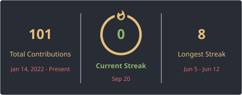

# Hi, I'm Zhenxi Gao

<pre align="center">
 __  __  ___  ____  ___ ____  _   _ ___ __  __    _      __
|  \/  |/ _ \|  _ \|_ _/ ___|| | | |_ _|  \/  |  / \    / /_
| |\/| | | | | |_) || |\___ \| |_| || || |\/| | / _ \  | '_ \
| |  | | |_| |  _ < | | ___) |  _  || || |  | |/ ___ \ | (_) |
|_|  |_|\___/|_| \_\___|____/|_| |_|___|_|  |_/_/   \_\ \___/
</pre>

<strong>Morishima6</strong>

## About Me

- Software Engineering master's student at **Nanjing University**, working with the **Language Intelligence Processing Laboratory (LipLab)**
- Researching **long-horizon agent systems**, computer-use agents, agentic RAG, and multimodal reasoning and evaluation
- Currently an Algorithm Intern with the **Multimodal LLM Department at SenseTime**, working on presentation-agent data and evaluation pipelines
- Contributing to **MURAL-Presenter**, a revision-aware multi-agent framework for long-horizon presentation authoring
- Developed **WANDER**, a human-trajectory retrieval-augmented framework for stable long-horizon GUI tasks
- Interested in research collaboration around agentic systems, GUI automation, and multimodal AI

## Featured Projects

### [MURAL-Presenter: Multi-agent Unified Revision-Aware Authoring for Long-horizon Presentations](https://morishima6.github.io/portfolio/mural-presenter/)

A skill-driven multi-agent framework for full-lifecycle presentation authoring. It addresses cross-stage dependencies, cross-slide consistency, and iterative revision through shared deck-level state and impact-aware coordination. My work includes THREAD-Bench, MURAL-Lite training, and systematic model evaluation.

### [Single-Page Slide Benchmark Rubric v2](https://github.com/Morishima6/single-page-slide-rubric)

A versioned evaluation toolkit for single-slide generation, with human-readable rubrics, machine-readable schemas, multi-judge prompts, deterministic scoring, and reproducible model-comparison workflows.

### [WANDER: Bridging Human Workflow and Automated Computer Use via Naturalistic Demonstrations and Enhanced Retrieval](https://github.com/Morishima6/Computer-Use-Agent)

A human-trajectory retrieval-augmented computer-use agent that converts historical desktop operation trajectories into reusable canonical units and combines interface-state retrieval with transition-based successor recall to reduce planning drift in long-horizon GUI tasks. [[AAAI 2027 Submission](https://openreview.net/forum?id=NKKGCmqWej)]

### [SE-Explorer Agent: A Lightweight ReAct Agent for Software Engineering Tasks](https://github.com/Morishima6/SE-Explorer-Agent)

A lightweight ReAct-style software engineering agent that dynamically retrieves technical documents, locates code, gathers evidence, proposes solutions, and verifies results through composable tools, Evidence Memory, trajectory logging, and verifier feedback.

### [GenJudge: Explainable Multi-Model Multimodal AIGC Detection](https://github.com/Morishima6/GenJudge)

An explainable framework that combines image forensics, text analysis, cross-modal logic, and multi-model critique to produce evidence-backed detection results.

## Publication

**LH-Net: A Lightweight Heterogeneous Convolutional Network for RSSC** 
Zhenxi Gao, *WCI3DT 2024, Smart Innovation, Systems and Technologies, vol. 418*, Springer, 2025. [[Paper](https://doi.org/10.1007/978-981-97-9124-8_28)]

## Skill Set

<table>
<tr>
<td valign="top" width="33%">

### AI & Agents

  

<code>LLM Agents</code> <code>RAG</code> <code>Multimodal Learning</code> <code>FAISS</code>

</td>
<td valign="top" width="33%">

### Languages

  

</td>
<td valign="top" width="33%">

### Engineering

  

</td>
</tr>
</table>

## Education

- **2025 - Present** - Nanjing University, LipLab - M.Eng. in Software Engineering
- **2021 - 2025** - Nanjing University of Aeronautics and Astronautics - B.Eng. in Computer Science and Technology

## Internships

- **2026 - Present** - SenseTime, Multimodal LLM Department - Algorithm Intern
- **2025** - GoLaxy, R&D Center - Algorithm Intern

## Connect with Me

  
  
  
  

## Github Stats

  

  

<h2 align="center">Check Out My Repositories &gt;&gt;</h2>
